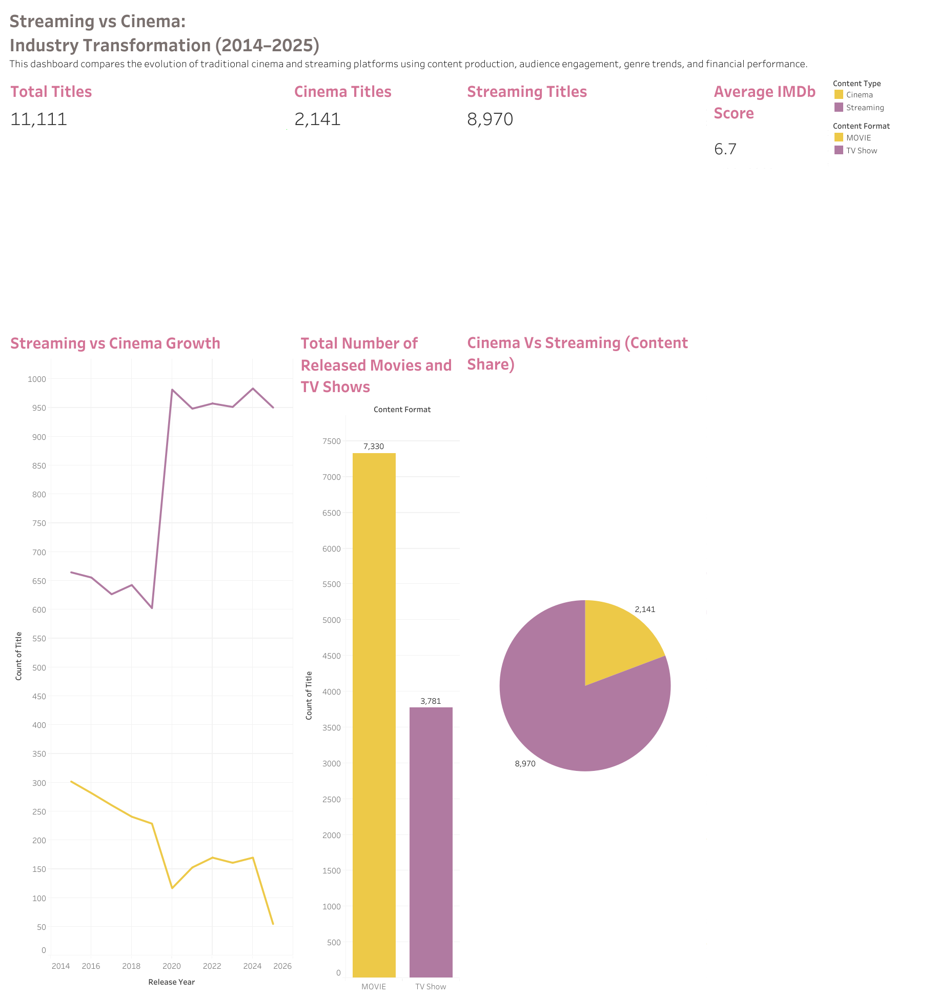
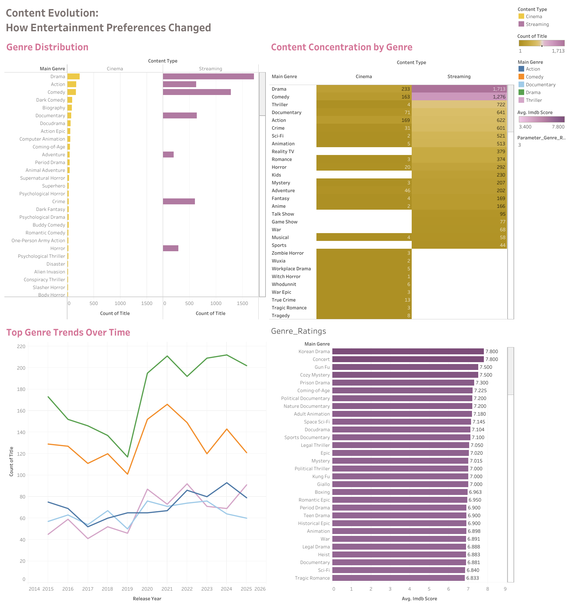
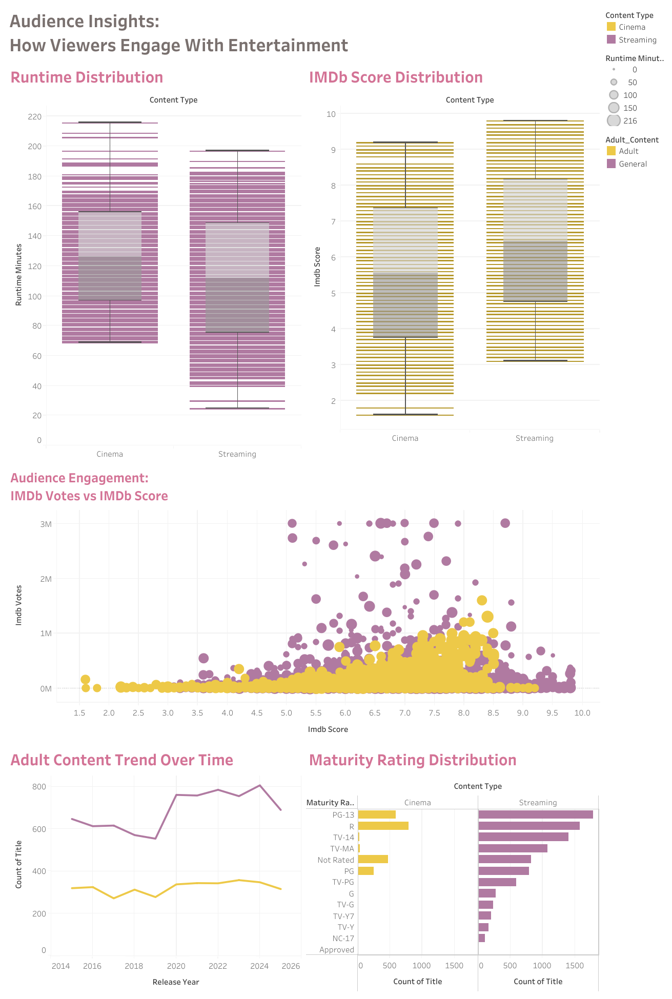
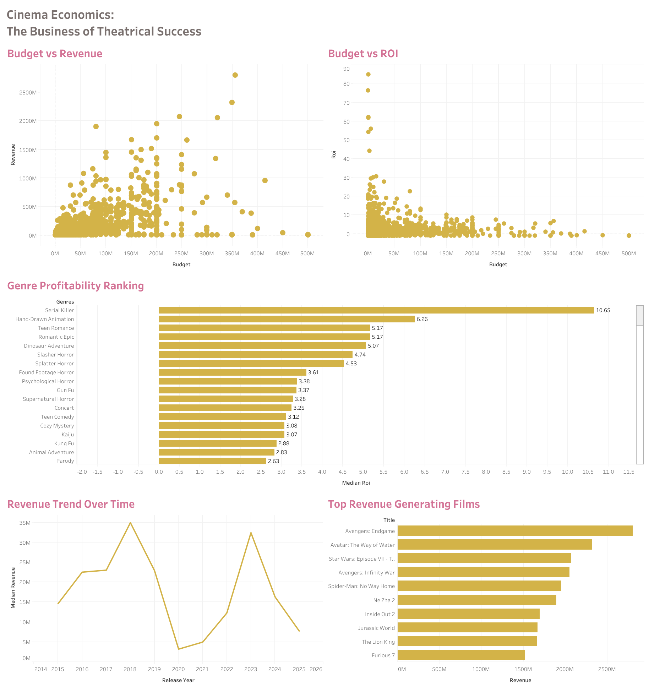

<div align="center">

# 🎬 Cinema vs. Streaming
## A Decade of Industry Transformation (2015–2025)


*A professional end-to-end data analytics project examining how the global entertainment industry transitioned from theatrical Cinema to Streaming-first content over a decade — combining Python-based exploratory data analysis and Tableau interactive dashboards.*

</div>

---

## 📌 Project Overview

This project investigates the structural transformation of the global entertainment industry from **2015 to 2025**, analysing **11,111 titles** across Cinema and Streaming platforms — with supplementary financial data on **2,141 theatrical releases** — across five analytical dimensions:

| # | Analysis | Focus |
|---|----------|-------|
| 1 | **Industry Growth Shift** | How content volumes diverged between Cinema and Streaming |
| 2 | **Genre Evolution** | Which genres each platform owns and how tastes changed over time |
| 3 | **Audience & Runtime Analysis** | IMDb scores, engagement (votes), and runtime trends |
| 4 | **Maturity Rating & Content Strategy** | Audience age-targeting strategies across platforms |
| 5 | **Cinema Financial Analysis** | ROI, budget vs revenue, and genre-level profitability |

---

## 🔗 Live Interactive Dashboard

<div align="center">

### [🖥️ View Full Interactive Dashboard on Tableau Public →](https://public.tableau.com/app/profile/akhfash.uddin.deepto/viz/Cinema_Vs_Streaming/Genre_Ratings)

</div>

The Tableau workbook contains **4 fully interactive dashboards** covering all five analyses — filterable by Content Type, Content Format, Genre, and Maturity Rating.

---

## 📊 Tableau Dashboard Previews

### 1️⃣ Executive Overview — Industry Transformation (2014–2025)


> **KPI Summary:** 11,111 Total Titles · 2,141 Cinema · 8,970 Streaming · 6.7 Average IMDb Score
>
> Covers: Industry-level KPI cards · Streaming vs Cinema growth line chart · Total Movies vs TV Shows bar chart · Cinema vs Streaming content share pie chart

---

### 2️⃣ Content Evolution — How Entertainment Preferences Changed


> Covers: Genre distribution diverging bar chart (Cinema vs Streaming) · Content concentration by genre table · Top 5 genre trends over time (2014–2025) · Genre ratings ranking bar chart

---

### 3️⃣ Audience Insights — How Viewers Engage With Entertainment


> Covers: Runtime distribution box plot · IMDb score distribution box plot · Audience engagement scatter (IMDb Votes vs IMDb Score) · Adult content trend over time · Maturity rating distribution by platform

---

### 4️⃣ Cinema Economics — The Business of Theatrical Success


> Covers: Budget vs Revenue scatter · Budget vs ROI scatter · Genre profitability ranking (Median ROI) · Revenue trend over time · Top 10 revenue-generating films

---

## 📁 Repository Structure

```
Cinema-Vs-Streaming-Analysis/
│
├── 📓 notebooks/
│   └── streaming_vs_cinema_analysis_final.ipynb   ← Main analysis (146 cells, 5 analyses)
│
├── 📊 tableau/
│   └── screenshots/
│       ├── Executive_Overview.png                 ← Dashboard 1: Industry KPIs & Growth
│       ├── Content_Evolution.png                  ← Dashboard 2: Genre Analysis
│       ├── Audience_Insights.png                  ← Dashboard 3: Ratings, Votes & Maturity
│       └── Cinema_Economics.png                   ← Dashboard 4: Financial Performance
│
├── 📂 data/
│   ├── master_dataset.csv                         ← 11,111 titles — core dataset
│   └── cinema_financials.csv                      ← 2,141 cinema titles with financials
│
├── requirements.txt                               ← Python dependencies
├── .gitignore                                     ← Files excluded from version control
└── README.md                                      ← This file
```

---

## 🗂️ Datasets

| File | Rows | Columns | Description |
|------|------|---------|-------------|
| `master_dataset.csv` | 11,111 | 9 | All titles — genre, format, IMDb score, votes, runtime, maturity rating |
| `cinema_financials.csv` | 2,141 | 7 | Cinema titles — budget, revenue, ROI, IMDb score |

### Variable Reference

**`master_dataset.csv`**
| Variable | Type | Description |
|----------|------|-------------|
| `title` | String | Title name |
| `release_year` | Integer | Year of release (2015–2025) |
| `runtime_minutes` | Integer | Runtime in minutes |
| `main_genre` | String | Primary genre classification |
| `maturity_rating` | String | Official rating (G, PG, PG-13, R, TV-MA, etc.) |
| `imdb_score` | Float | IMDb audience rating (0–10) |
| `content_format` | String | MOVIE or TV Show |
| `content_type` | String | Cinema or Streaming |
| `imdb_votes` | Integer | Total number of IMDb votes |

**`cinema_financials.csv`**
| Variable | Type | Description |
|----------|------|-------------|
| `title` | String | Film title |
| `release_year` | Integer | Year of theatrical release |
| `genres` | String | Genre classification |
| `budget` | Float | Production budget (USD) |
| `revenue` | Integer | Box office revenue (USD) |
| `roi` | Float | Return on investment (revenue / budget) |
| `imdb_score` | Float | IMDb audience rating (0–10) |

---

## 🔬 Analyses & Key Findings

### Analysis 1 — Industry Growth Shift
*📊 Tableau: Executive Overview dashboard*

| Sub-Analysis | Visualisation |
|---|---|
| 1.1 Annual Content Volume: Streaming vs Cinema | Line Chart |
| 1.2 Content Format Growth: Movies vs TV Shows | Line Chart |
| 1.3 Streaming Platform Content Mix by Format | Grouped Bar Chart |

> **Headline Finding:** Streaming accounts for **80.7% of all content production** (8,970 vs 2,141 titles). COVID-19 (2020) collapsed Cinema output by **−49%** while Streaming surged **+63%** — permanently accelerating the structural shift.

---

### Analysis 2 — Genre Evolution Analysis
*📊 Tableau: Content Evolution dashboard*

| Sub-Analysis | Visualisation |
|---|---|
| 2.1 Genre Distribution by Platform | Diverging Bar Chart (Full + Capped) |
| 2.2 Genre Distribution by Format: Movies vs TV Shows | Horizontal Bar Chart |
| 2.3 Top 5 Genre Trends Over Time (2015–2025) | Multi-Line Chart |
| 2.4 Genre Concentration Heatmap | Heatmap |
| 2.5 Average IMDb Score by Genre | Horizontal Bar Chart |

> **Headline Finding:** Streaming has claimed entire genre categories — **Reality TV (100%), Sci-Fi (99.6%), Thriller (99.4%)**. Korean Drama and Concert top the ratings chart at **7.80 average IMDb score**, confirming niche genres outperform mass-market content in audience satisfaction.

---

### Analysis 3 — Audience & Runtime Analysis
*📊 Tableau: Audience Insights dashboard*

| Sub-Analysis | Visualisation |
|---|---|
| 3.1 Comparative IMDb Score Statistics | Descriptive Table |
| 3.2 IMDb Score Distribution: Cinema vs Streaming | Box Plot |
| 3.3 IMDb Score Distribution: Movies vs TV Shows | Box Plot |
| 3.4 Audience Engagement by Content Type | Scatter Plot (IMDb Votes vs Score) |
| 3.5 Runtime Distribution: Movies vs TV Shows | Box Plot |
| 3.6 Average Runtime Trend Over Time | Line Chart |
| 3.7 Top 10 Highest Rated Genres | Bar Chart |
| 3.8 Audience Engagement vs IMDb Score | Scatter Plot |

> **Headline Finding:** Streaming's average IMDb score (**6.81**) exceeds Cinema's (**6.36**) despite 4× more content. Cinema generates **~4× more IMDb votes per title** (median 33,000 vs 8,070) — its last major competitive advantage. Cinema runtimes average ~115 min vs ~80 min for Streaming.

---

### Analysis 4 — Maturity Rating & Content Strategy
*📊 Tableau: Audience Insights dashboard*

| Sub-Analysis | Visualisation |
|---|---|
| 4.1 Maturity Ratings Inspection & Group Distribution | Value Counts Table |
| 4.2 Maturity Rating Volume: Streaming vs Cinema | Grouped Bar Chart |
| 4.3 Maturity Rating Distribution (%) by Platform | Percentage Bar Chart |
| 4.4 Maturity Distribution by Content Format | Grouped Bar Chart |
| 4.5 Adult-Rated Content Production Trend | Line Chart |
| 4.6 Average IMDb Score by Maturity Group | Bar Chart |
| 4.7 Content Concentration Heatmap | Heatmap |

> **Headline Finding:** Streaming pursues a **Teen-first (50.8%) + Kids-invested (7.0%)** subscriber-maximisation strategy; Cinema leans **Adult-heavy (37.7%)** for ROI efficiency. PG-13 is the single most common rating on both platforms. IMDb scores are **maturity-neutral** — all groups score within 0.09 points of each other.

---

### Analysis 5 — Cinema Financial Analysis
*📊 Tableau: Cinema Economics dashboard*

| Sub-Analysis | Visualisation |
|---|---|
| 5.1 Initial Inspection | Dataset Overview |
| 5.2 Financial Summary Statistics | Descriptive Table |
| 5.3 Cinema ROI Distribution | Box Plot |
| 5.4 Budget vs Revenue | Log-Scale Scatter Plot |
| 5.5 Median ROI by Genre | Horizontal Bar Chart |
| 5.6 Median Revenue by Genre | Horizontal Bar Chart |
| 5.7 IMDb Score vs ROI | Scatter Plot |
| 5.8 Median Revenue Trend Over Time | Line Chart |
| 5.9 Financial Correlation Analysis | Correlation Matrix |
| 5.10 Financial Correlation Heatmap | Heatmap |

> **Headline Finding:** Only **36.6% of theatrical films are profitable**. **Budget has zero predictive power** for Revenue, ROI, or IMDb score (correlation: −0.006). **Avengers: Endgame** leads all-time box office at ~$2.8B. Serial Killer genre leads ROI at **10.64×**. Post-pandemic median revenue remains 53–71% below the 2018 peak of $35.7M.

---

## 📈 Master Summary: Cinema vs. Streaming

| Metric | Cinema | Streaming |
|--------|--------|-----------|
| Total Titles (2015–2025) | 2,141 | **8,970** |
| Market Share (by volume) | 19.3% | **80.7%** |
| Avg IMDb Score | 6.36 | **6.81** |
| Median IMDb Votes / Title | **33,000** | 8,070 |
| Genre Breadth | Narrow (4–5 core) | **Broad (25+ genres)** |
| Avg Movie Runtime | **~115 min** | ~80 min |
| Dominant Maturity Category | Teen / Adult balanced | **Teen-first (50.8%)** |
| Kids Content Share | 0.5% | **7.0%** |
| Adult Content Post-2020 | 📉 Declining | 📈 ~290 titles/year |
| Top Revenue Film | Avengers: Endgame (~$2.8B) | N/A |
| Box Office Profitability | 36.6% of films profitable | N/A (subscription model) |
| Post-2020 Growth Trajectory | 📉 Partial recovery | 📈 Structurally dominant |

---

## 🛠️ Tech Stack

| Tool | Version | Purpose |
|------|---------|---------|
| **Python** | 3.10+ | Core programming language |
| **Pandas** | 2.0+ | Data manipulation and aggregation |
| **NumPy** | 1.24+ | Numerical operations |
| **Matplotlib** | 3.7+ | Base plotting library |
| **Seaborn** | 0.12+ | Statistical data visualisation |
| **Jupyter Notebook** | 7.0+ | Interactive analysis environment |
| **Tableau Public** | Latest | Interactive dashboard creation |

---

## ⚙️ How to Run

### 1. Clone the repository
```bash
git clone https://github.com/YOUR_USERNAME/Cinema-Vs-Streaming-Analysis.git
cd Cinema-Vs-Streaming-Analysis
```

### 2. Install dependencies
```bash
pip install -r requirements.txt
```

### 3. Launch Jupyter
```bash
jupyter notebook notebooks/streaming_vs_cinema_analysis_final.ipynb
```

### 4. Run all cells
In Jupyter: **Kernel → Restart & Run All**

> ⚠️ Ensure both CSV files are in the `data/` folder and update the notebook's data loading cells accordingly:
> ```python
> df           = pd.read_csv("../data/master_dataset.csv")
> financial_df = pd.read_csv("../data/cinema_financials.csv")
> ```

---

## 🧠 Author

**Akhfash Uddin Deepto**

[](https://public.tableau.com/app/profile/akhfash.uddin.deepto)
[](https://linkedin.com/in/YOUR_LINKEDIN)
[](mailto:YOUR_EMAIL)

---

## 📄 License

This project is licensed under the **MIT License** — feel free to use, share, and build upon this work with attribution.

---

## 🙏 Acknowledgements

- Dataset sourced from publicly available IMDb and box office records
- [Tableau Public](https://public.tableau.com) for free interactive visualisation hosting
- [Seaborn](https://seaborn.pydata.org) and [Matplotlib](https://matplotlib.org) communities for excellent documentation

---

<div align="center">

*⭐ If you found this project useful or interesting, please consider starring the repository!*

</div>
